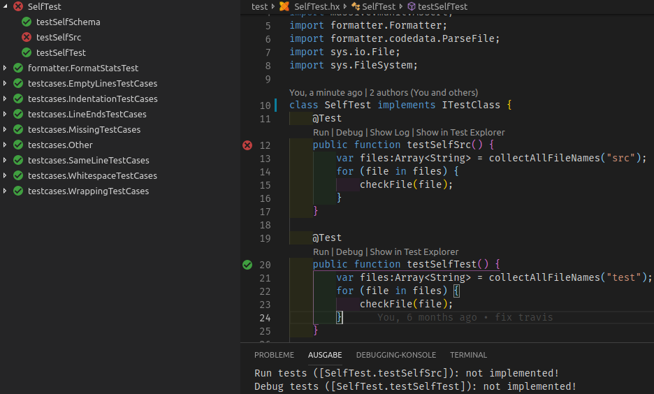

# Haxe Test Adapter for VSCode

A test adapter for VSCode using `hbenl.vscode-test-explorer`


## Features

* Shows munit test results in test explorer

## Installation

Install `haxelib install haxe-test-adapter`
Install `hbenl.vscode-test-explorer` VSCode extension
Install `haxe-test-adapter` VSCode extension

## Build from sources

(Linux)
```
cd /home/github
git clone https://github.com/AlexHaxe/haxe-test-adapter
cd haxe-test-adapter
haxe build.hxml
ln -s `pwd` ~/.vscode/extensions
haxelib dev haxe-test-adapter `pwd`
```

## Usage

### Munit

* Add `-lib haxe-test-adapter` to your `buildTest.hxml` / build configuration
* Add `implements unittesthelper.ITestClass` to your test classes - helps record test positions (file name and line numbers)
* Add `runner.addResultClient(new unittesthelper.munit.MunitTestResultClient());` to your `massive.munit.TestRunner`, then run your unittests.

You should see a folder named `.unittest` in your project root. 

## TODO

* add file name and line numbers for all test functions
* running of tests
* support other unittest frameworks