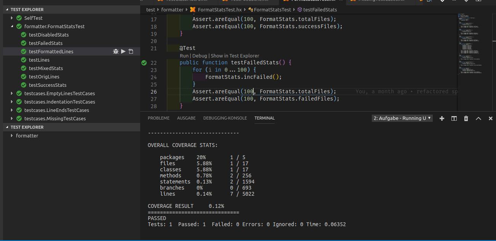

# Haxe Test Explorer for Visual Studio Code

[](https://travis-ci.org/vshaxe/haxe-test-adapter) [](https://marketplace.visualstudio.com/items?itemName=vshaxe.haxe-test-adapter) [](https://marketplace.visualstudio.com/items?itemName=vshaxe.haxe-test-adapter)


A test adapter for VSCode using the [Test Explorer UI](https://marketplace.visualstudio.com/items?itemName=hbenl.vscode-test-explorer) extension.



## Features

* Records [munit](https://github.com/massiveinteractive/MassiveUnit), [utest](https://github.com/haxe-utest/utest) and [haxe.unit](https://api.haxe.org/haxe/unit/TestRunner.html) test results as JSON files
* Shows latest test results in VSCode using the Test Explorer UI extension
* Supports filtering / running individual tests directly from VSCode
* Supports Haxe 3.4.7 and 4.0.0-rc.1
* Currently only works for Node.js and sys targets

## Usage

You can run your tests using the `Test Explorer: Run all tests` command or by clicking the button in the "Test" tab of the activity bar. The command that it runs can be configured with this setting:

```json
"haxeTestExplorer.testCommand": [
	"${haxe}",
	"test.hxml",
	"-lib",
	"test-adapter"
]
```

As you can see, by default it assumes the presence of a `test.hxml` that compiles and runs the tests. Additionally, the `test-adapter` library is injected (which is automatically installed with this extension). It adds hooks to the different testing frameworks to record the test results in a `.unittest` folder in your workspace.

`.unittest` should be added to your `.gitignore`. You might also want to hide it from VSCode's file explorer by adding this to your global settings:

```json
"files.exclude": {
	"**/.unittest": true
}
```

It's also possible to debug tests using a launch configuration from `launch.json`. Which one should be used can be configured with this setting:

```json
"haxeTestExplorer.launchConfiguration": "Debug"
```

## Build from sources

```bash
cd ~/.vscode/extensions
git clone https://github.com/vshaxe/haxe-test-adapter
cd haxe-test-adapter
npm install
haxe build.hxml
```

## TODO

* add line numbers for all test functions for Haxe 3 builds
* implement filtering for haxe.unit
* add support for additional unittest frameworks